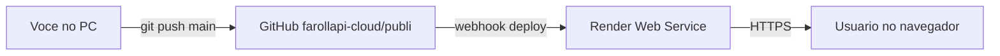

# Onde o deploy acontece — GitHub, Render e o que este projeto usa

**Este ficheiro é a fonte canónica** para GitHub, Render, URLs e integrações. Assistentes de IA e humanos devem alinhar-se a ele; instruções resumidas para IAs: [`../AGENTS.md`](../AGENTS.md). Continuidade entre sessões: [`continuidade.md`](continuidade.md).

Este documento descreve **onde** o código vive, **onde** ele é implantado e **quais serviços externos** entram no fluxo. Atualize os endereços entre colchetes `[ ]` se o seu ambiente mudar.

---

## 1. Repositório Git (fonte da verdade do código)

| O quê | Valor |
|--------|--------|
| **Repositório** | `farollapi-cloud/publi` |
| **URL no GitHub** | [https://github.com/farollapi-cloud/publi](https://github.com/farollapi-cloud/publi) |
| **Branch de deploy** | `main` (é o que a Render costuma usar com auto-deploy) |

**O que acontece:** cada `git push` para o `main` pode disparar um **novo deploy** na Render, se o serviço estiver ligado a esse repositório com auto-deploy ativo.

---

## 2. Hospedagem — Render (onde o app fica no ar)

| O quê | Valor |
|--------|--------|
| **Plataforma** | [Render](https://render.com) |
| **Painel** | [https://dashboard.render.com](https://dashboard.render.com) |
| **Tipo de serviço** | **Web Service** (Node.js) |
| **Root Directory** | `opensquad-service` (só esta pasta é o “app” que sobe; o resto do monorepo vem no clone completo) |

### URL pública do serviço (exemplo)

Substitua pelo URL que aparece no seu serviço em **Settings → URL**:

| Uso | Exemplo (ajuste ao seu) |
|-----|-------------------------|
| Site / API | `https://publi-w14v.onrender.com` |
| Health check | `https://publi-w14v.onrender.com/health` |
| Interface web (React) | `https://publi-w14v.onrender.com/admin/publicidade/` |
| API JSON (admin) | prefixo `/api/admin/publicidade/...` |

> **Nota:** o subdomínio (`publi-w14v`) é gerado pela Render; pode mudar se você recriar o serviço ou mudar o nome.

### O que a Render executa (resumo)

1. **Clone** do repositório GitHub (repo inteiro).
2. **Build** na pasta `opensquad-service` (comandos no painel ou `npm run build` / `postinstall` / `start.mjs` — ver README e `RENDER_PANEL.md`).
3. **Start:** `npm start` → [`start.mjs`](../opensquad-service/start.mjs) → sobe o Express em [`src/server.js`](../opensquad-service/src/server.js).

Arquivo de referência do painel: [`opensquad-service/RENDER_PANEL.md`](../opensquad-service/RENDER_PANEL.md).

### Blueprint (opcional)

Na **raiz** do repo existe [`render.yaml`](../render.yaml). Pode ser usado para criar/atualizar o serviço via **Blueprint** na Render (infraestrutura como código).

---

## 3. Fluxo visual (do commit ao browser)

1. Você altera o código e faz **push** para `main`.
2. A **Render** puxa o commit e roda **build + start**.
3. O usuário acessa a **URL `*.onrender.com`** (ou domínio customizado, se configurar).

---

## 4. O que existe **dentro** deste repositório (pastas)

| Pasta | Deploy na Render? | Função |
|--------|-------------------|--------|
| [`opensquad-service/`](../opensquad-service/) | **Sim** — é o alvo do Web Service | API Node (Express), serve o front estático, executa OpenSquad via CLI |
| [`publicidade-frontend/`](../publicidade-frontend/) | **Não** como serviço separado | Código-fonte do React; o **build** vira arquivos em `opensquad-service/static-ui` |
| [`app/modules/publicidade/`](../app/modules/publicidade/) | **Não** neste deploy | Módulo **Django Ninja** opcional, para outro backend Python; **não** roda na Render deste projeto Node |
| [`docs/`](../docs/) | Não | Documentação |

---

## 5. Repositórios externos (não são o “seu” deploy)

| Repositório | Papel |
|-------------|--------|
| [renatoasse/opensquad](https://github.com/renatoasse/opensquad) | Framework multiagente. No **build** ou **start**, o clone fica em `opensquad-service/opensquad/`. **Não** é onde você dá `git push` do seu app Publi. |

---

## 6. Supabase — **este projeto não usa**

No código deste repositório **não há** integração com Supabase, Postgres gerenciado, Neon, MongoDB, etc.

- **Logs de execução** do serviço Node: arquivo JSON em `opensquad-service/logs/` (filesystem do container na Render).
- **Variáveis** importantes: `OPENAI_API_KEY`, `PATH_OPENSQUAD`, `PORT` (injetada pela Render).

Se no futuro você quiser **Supabase** (auth, Postgres, storage), será uma **nova** integração — não faz parte do desenho atual do Publi neste repo.

---

## 7. Variáveis de ambiente (Render)

Configure em **Render → seu serviço → Environment**:

| Variável | Obrigatório? | Função |
|----------|--------------|--------|
| `OPENAI_API_KEY` | Sim, para rodar squads com API OpenAI | Chave da OpenAI |
| `PATH_OPENSQUAD` | Opcional (default `./opensquad`) | Pasta do clone do OpenSquad |
| `NODE_VERSION` | Opcional | Ex.: `20` |
| `PORT` | Geralmente **não** definir manualmente | A Render define automaticamente |

Secrets: marque `OPENAI_API_KEY` como secret no painel.

---

## 8. Checklist rápido “está tudo no lugar?”

- [ ] Repositório correto: `github.com/farollapi-cloud/publi`, branch `main`.
- [ ] Render: Web Service ligado a esse repo, **Root Directory** = `opensquad-service`.
- [ ] **Build Command** e **Start Command** conforme [`RENDER_PANEL.md`](../opensquad-service/RENDER_PANEL.md).
- [ ] `GET https://SEU-APP.onrender.com/health` retorna `"ui": true` quando o front foi gerado.
- [ ] UI: `https://SEU-APP.onrender.com/admin/publicidade/`.

---

## 9. Onde editar este documento

Arquivo: [`docs/DEPLOY_E_INTEGRACOES.md`](DEPLOY_E_INTEGRACOES.md) (esta pasta `docs/` no repo).

Quando mudar de URL na Render ou de organização no GitHub, atualize a **tabela de URLs** e o nome do repositório neste ficheiro. Atualize também [`continuidade.md`](continuidade.md).

---

## 10. Histórico de alterações relevantes (deploy)

Para o detalhe completo de commits, use `git log`. Marcos resumidos ficam em [`continuidade.md`](continuidade.md) (secção *Marcos / alterações recentes*).
